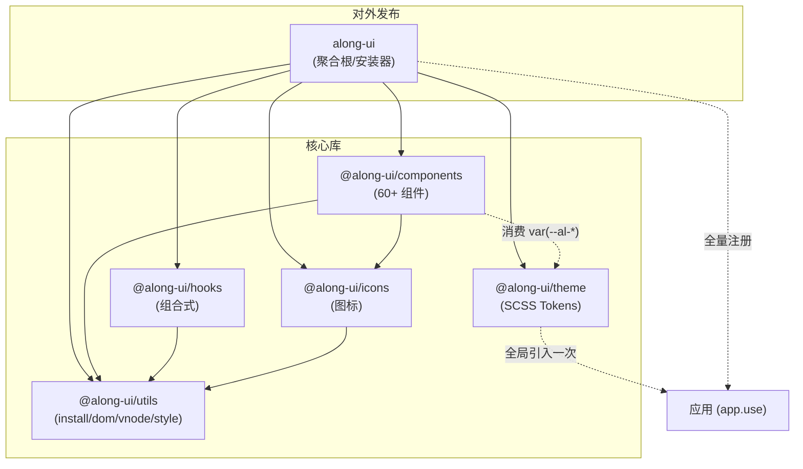

# alongUI 设计系统 & 组件架构文档

> 适用版本：`0.0.0`（pnpm monorepo，Vue 3.5+）
> 维护角色：设计架构师
> 配套文档：`project/reviews/PRD-vs-CODE-GAP.md`（注：该 GAP 报告已**过时**，本文第 5 章逐条给出真实状态）

本文档形式化描述 alongUI 的设计 Token 契约、主题机制、组件架构、构建/打包架构，并对照 Apple HIG 标注当前对齐度与剩余差距。

---

## 1. Design Token 契约

所有设计 Token 以 **CSS 自定义属性（CSS Custom Properties）** 形式集中在 `packages/theme/src/variables.scss`，命名空间前缀统一为 `--al-`。Token 在 `:root`（亮色）声明，暗色通过 `[data-theme='dark']` 选择性覆盖（见第 2 章）。

> 契约纪律：**组件样式只允许消费 `var(--al-*)` Token，禁止硬编码色值/尺寸**。组件内出现的硬编码 fallback（如 `var(--al-color-success, #34c759)`）仅作为兜底，正常路径下不应触发。

### 1.1 颜色 —— 基础原语（Color Primitives）

| Token | 亮色值 | 说明 |
|-------|--------|------|
| `--al-color-white` | `#ffffff` | 纯白 |
| `--al-color-black` | `#000000` | 纯黑 |

### 1.2 颜色 —— 背景（Background）

| Token | 亮色值 | 暗色值 | 语义 |
|-------|--------|--------|------|
| `--al-bg-color` | `#f5f5f7` | `#1c1c1e` | 应用基础背景（body） |
| `--al-bg-color-page` | `#e8e8ed` | `#2c2c2e` | 页面级背景 |
| `--al-bg-color-sidebar` | `#ebebf0` | `#3a3a3c` | 侧边栏背景 |
| `--al-bg-color-overlay` | `#ffffff` | `#2c2c2e` | 浮层表面（popover/menu） |
| `--al-bg-color-elevated` | `#fafafa` | `#3a3a3c` | 抬升表面（卡片/工具栏） |
| `--al-bg-color-hover` | `#e8e8ed` | `#3a3a3c` | 悬停态背景 |
| `--al-bg-color-input` | `#f2f2f7` | `#3a3a3c` | 输入框/默认按钮背景 |

### 1.3 颜色 —— 文本（Text）

| Token | 亮色值 | 暗色值 | 语义 |
|-------|--------|--------|------|
| `--al-text-color-primary` | `#1d1d1f` | `#f5f5f7` | 主文本 |
| `--al-text-color-regular` | `#3a3a3c` | `#e5e5ea` | 常规文本 |
| `--al-text-color-secondary` | `#6e6e73` | `#aeaeb2` | 次要文本 |
| `--al-text-color-placeholder` | `#8e8e93` | `#8e8e93` | 占位符 |
| `--al-text-color-disabled` | `#c7c7cc` | `#48484a` | 禁用文本 |
| `--al-text-color-inverse` | `#ffffff` | `#1c1c1e` | 反色文本（填充按钮上） |

### 1.4 颜色 —— 边框（Border）

| Token | 亮色值 | 暗色值 |
|-------|--------|--------|
| `--al-border-color` | `#d2d2d7` | `#48484a` |
| `--al-border-color-light` | `#e5e5ea` | `#3a3a3c` |
| `--al-border-color-lighter` | `#f2f2f7` | `#2c2c2e` |

### 1.5 颜色 —— 语义/品牌色（Semantic / Brand）

| Token | 亮色值 | 暗色值 | 语义 |
|-------|--------|--------|------|
| `--al-color-primary` | `#007aff` | — | 主色（iOS 蓝） |
| `--al-color-primary-hover` | `#3395ff` | — | 主色悬停 |
| `--al-color-primary-light` | `#e8f2ff` | — | 主色浅底（选中背景等） |
| `--al-color-primary-dark` | `#0055cc` | — | 主色按下/深态 |
| `--al-color-success` | `#34c759` | — | 成功（iOS 绿） |
| `--al-color-success-hover` | `#2db84e` | — | 成功悬停 |
| `--al-color-warning` | `#ff9500` | — | 警告（iOS 橙） |
| `--al-color-danger` | `#ff3b30` | — | 危险（iOS 红） |
| `--al-color-info` | `#007aff` | — | 信息（复用主蓝） |

> **设计决策**：品牌/语义色在暗色下**不覆盖**（暗色仅列背景/文本/边框）。这与 Apple HIG 一致——系统语义色在两种外观下保持同一色相，仅通过所在表面明暗自然适配。

### 1.6 字体排印（Typography）

| Token | 值 | 映射（Apple 文本样式） |
|-------|----|------------------------|
| `--al-font-family` | `-apple-system, BlinkMacSystemFont, 'SF Pro Display', 'SF Pro Text', 'Helvetica Neue', 'PingFang SC', 'Microsoft YaHei', sans-serif` | 系统字体栈（优先 SF Pro / PingFang） |
| `--al-font-size-title1` | `28px` | Title 1 |
| `--al-font-size-title2` | `22px` | Title 2 |
| `--al-font-size-title3` | `18px` | Title 3 |
| `--al-font-size-headline` | `15px` | Headline |
| `--al-font-size-body` | `14px` | Body |
| `--al-font-size-callout` | `13px` | Callout |
| `--al-font-size-subhead` | `12px` | Subhead |
| `--al-font-size-footnote` | `11px` | Footnote |
| `--al-font-size-base` | `var(--al-font-size-body)` | 基准尺寸别名 |
| `--al-font-weight-regular` | `400` | |
| `--al-font-weight-primary` | `400` | body 默认字重 |
| `--al-font-weight-medium` | `500` | |
| `--al-font-weight-semibold` | `600` | 强调（按钮/标题常用） |
| `--al-font-weight-bold` | `700` | |

### 1.7 间距（Spacing）

| Token | 值 |
|-------|----|
| `--al-spacing-1` | `4px` |
| `--al-spacing-2` | `8px` |
| `--al-spacing-3` | `12px` |
| `--al-spacing-4` | `16px` |
| `--al-spacing-5` | `20px` |
| `--al-spacing-6` | `24px` |

> 4 的倍数基准，契合 iOS 8pt 栅格（在 2x/3x 下对应 8/12pt）。

### 1.8 圆角（Border Radius）

| Token | 值 | 典型用途 |
|-------|----|----------|
| `--al-border-radius-xs` | `4px` | 内部小元素 |
| `--al-border-radius-small` | `6px` | 默认控件 |
| `--al-border-radius-base` | `6px` | 基准（与 small 同值，保留作语义别名） |
| `--al-border-radius-medium` | `8px` | 卡片/中等容器 |
| `--al-border-radius-large` | `12px` | 主按钮/大圆角控件 |
| `--al-border-radius-xl` | `16px` | 弹窗/大表面积 |
| `--al-border-radius-round` | `999px` | 全胶囊（徽标/开关轨道/清除按钮） |
| `--al-border-radius-circle` | `50%` | 圆形（头像/开关滑块/单选） |

### 1.9 投影 / 浮层（Elevation）

| Token | 值 | 用途 |
|-------|----|------|
| `--al-box-shadow-light` | `0 1px 3px rgba(0,0,0,0.04)` | 轻浮层（卡片） |
| `--al-box-shadow-base` | `0 2px 8px rgba(0,0,0,0.06)` | 基础浮层 |
| `--al-box-shadow-dropdown` | `0 4px 12px rgba(0,0,0,0.08)` | 下拉 |
| `--al-box-shadow-modal` | `0 8px 24px rgba(0,0,0,0.1)` | 模态 |
| `--al-tooltip-bg` | `rgba(29,29,31,0.94)` | Tooltip 表面（暗色下反转为 `rgba(245,245,247,0.94)`） |
| `--al-overlay-mask-bg` | `rgba(255,255,255,0.72)` | 遮罩（暗色下为 `rgba(28,28,30,0.72)`） |

### 1.10 层级（z-index）

| Token | 值 | 用途 |
|-------|----|------|
| `--al-z-index-normal` | `1` | 常规流内元素（如 input 内部 prefix/suffix） |
| `--al-z-index-dropdown` | `1000` | 下拉 |
| `--al-z-index-popper` | `2000` | Popper 浮层 |
| `--al-z-index-tooltip` | `3000` | Tooltip |
| `--al-z-index-overlay` | `4000` | 遮罩 |
| `--al-z-index-modal` | `5000` | 模态框 |
| `--al-z-index-message` | `6000` | 全局消息 |
| `--al-z-index-notification` | `7000` | 通知 |

### 1.11 动效（Motion）

| Token | 值 |
|-------|----|
| `--al-transition-duration` | `0.3s` |
| `--al-transition-duration-fast` | `0.2s` |
| `--al-transition-function` | `cubic-bezier(0.4, 0, 0.2, 1)`（标准缓动） |

### 1.12 明/暗双主题覆盖矩阵

亮色在 `:root` 全量声明；暗色仅在 `[data-theme='dark']` 覆盖下表中的 Token（其余沿用亮色值）：

| 类别 | 暗色覆盖的 Token |
|------|------------------|
| 背景 | `bg-color`, `bg-color-page`, `bg-color-sidebar`, `bg-color-overlay`, `bg-color-elevated`, `bg-color-hover`, `bg-color-input` |
| 文本 | `text-color-primary`, `text-color-regular`, `text-color-secondary`, `text-color-placeholder`, `text-color-disabled`, `text-color-inverse` |
| 边框 | `border-color`, `border-color-light`, `border-color-lighter` |
| 浮层 | `tooltip-bg`, `overlay-mask-bg` |
| 品牌/语义色 | **无**（刻意保留） |

---

## 2. 主题机制

### 2.1 技术选型：CSS 变量 + SCSS 双轨

- **运行时主题 = CSS 自定义属性**（`variables.scss` 中的 `--al-*`）。组件在编译期通过 `var(--al-*)` 引用，运行时由浏览器解析，`data-theme` 切换零成本、无重渲染。
- **编译期组织 = SCSS**。`variables.scss` / `reset.scss` 用 SCSS 编写，`index.scss` 通过 `@use` 聚合：

  ```scss
  // packages/theme/src/index.scss
  @use './variables';
  @use './reset';
  ```

  `@use` 保证只输出一次变量与 reset，避免重复。

### 2.2 入口与全局 reset

`reset.scss` 负责全局基线：

- `*, *::before, *::after { box-sizing: border-box; }`
- `body`：归零 margin，应用 `--al-text-color-primary` / `--al-bg-color` / `--al-font-family` / `--al-font-size-base` / `--al-font-weight-primary`
- 表单控件 `button/input/textarea/select { font: inherit; }`（继承而非重置）
- **全局焦点态**：`*:focus-visible { outline: 2px solid var(--al-color-primary); outline-offset: 2px; }`，暗色下仅替换 outline 颜色为主蓝
  - 这是一处**关键的对外契约**：焦点环统一为「主蓝色 2px + 2px 偏移」，组件无需各自实现，避免原始 GAP 中「黑色 outline」的问题（见第 5 章）。

### 2.3 消费端如何覆盖 Token

CSS 变量天然可被更高优先级选择器覆写，三种典型方式：

1. **品牌换肤（最推荐）**：在 `:root` 或某作用域选择器上重定义变量，全站生效。

   ```css
   :root {
     --al-color-primary: #ff2d55; /* 把主色换成系统粉 */
   }
   ```

2. **局部主题作用域**：把变量覆盖限定在某个容器，不影响全局。

   ```css
   .my-panel {
     --al-bg-color: #ffffff;
     --al-text-color-primary: #111;
   }
   ```

3. **应用主题（暗色切换）**：在 `<html>` 或祖先节点设置 `data-theme`，触发第 1.12 章的暗色覆盖矩阵。

### 2.4 暗色切换（`data-theme="dark"`）

- 机制：`[data-theme='dark']` 选择器命中后，覆盖矩阵中的背景/文本/边框/浮层 Token 生效；未列出的 Token（品牌色等）沿用亮色值。
- 切换成本：仅修改一个 DOM 属性（如 `document.documentElement.dataset.theme = 'dark'`），无 CSS 重编译、无组件重渲染。
- 推荐封装为 Composable（见 `@along-ui/hooks`），但本仓库当前未内置 `useDark`——可作为后续增强项。

### 2.5 如何新增一个 Token（规范流程）

1. **命名**：`--al-{category}-{name}`，沿用既有分类（color / bg / text / border / spacing / font-size / font-weight / border-radius / box-shadow / z-index / transition）。
2. **声明位置**：在 `packages/theme/src/variables.scss` 的 `:root` 区块、对应分类注释下添加。
3. **暗色适配**：若该 Token 在暗色下需变化（背景/文本/边框/浮层类），在 `[data-theme='dark']` 区块同步追加覆盖；品牌/语义色一般不覆盖。
4. **消费**：组件 `.scss` 中通过 `var(--al-新token)` 引用，必要时给一个本地 fallback（仅在 Token 缺失时触发）。
5. **禁止**：组件内直接写死色值/尺寸；新增 Token 必须经设计架构师评审以确保与 Apple HIG 一致。

---

## 3. 组件架构

### 3.1 分层模型

组件按抽象层级分三类，依赖严格单向向下：

| 层 | 职责 | 示例 |
|----|------|------|
| **基础原语（Primitives）** | 最小可复用 UI 单元，直接消费 Token，无业务语义 | `button`、`input`、`switch`、`icon`、`link`、`tag`、`avatar`、`divider`、`typography`、`progress`、`skeleton`、`image` |
| **复合组件（Composite）** | 由基础原语组合，带交互状态机 | `select`、`dropdown`、`popover`、`tooltip`、`dialog`、`drawer`、`menu`、`tabs`、`steps`、`breadcrumb`、`collapse`、`tree`、`form` + `form-item`、`checkbox`/`radio` 组、日期/时间/颜色选择器 |
| **业务/高级（Business / Advanced）** | 面向场景的复杂编排，常聚合数据层 | `table` + `table-column`、`pagination`、`upload`、`carousel`、`calendar`、`cascader`、`slider`、`rate`、`search-table`、`notification`、`message`、`message-box`、`guide`、`timeline`、`result`、`infinite-scroll` |

> **布局/结构类**：`container`(header/aside/main/footer)、`stack`、`grid`、`center`、`spacer`、`page`、`affix`、`backtop`、`empty`、`descriptions`、`video` 等作为横切能力，可服务于任意一层。

### 3.2 依赖方向

- 组件 → 仅依赖 `@along-ui/icons` 与 `@along-ui/utils`（见 `packages/components/package.json`）。
- 组件 **不** 反向依赖 `along-ui` 聚合包，也不互相跨层硬依赖（复合组件通过 props/slots 组合基础原语）。
- 所有公共能力（安装器 `withInstall`/`makeInstaller`、DOM 工具、vnode 工具、样式工具）下沉到 `@along-ui/utils`，避免组件间重复实现。

### 3.3 组件如何消费 Token 与 Hooks

**消费 Token**：每个组件自带 `style/index.scss`，样式中直接使用 `var(--al-*)`。例（`input/style/index.scss`）：

```scss
.al-input__inner {
  border: none;
  border-radius: 10px;                 /* 对齐 iOS 搜索栏 */
  background: var(--al-bg-color-input);
  font-family: var(--al-font-family);
  font-size: var(--al-font-size-body);
  transition: background-color var(--al-transition-duration-fast) var(--al-transition-function);
}
```

**组件注册（消费 utils）**：`index.ts` 通过 `withInstall` 包装为带 `install` 的插件，便于 `app.use()`：

```ts
import { withInstall } from '@along-ui/utils'
import Button from './src/button.vue'
export const AlButton = withInstall(Button)
```

**消费 Hooks**：弹层/焦点类组件复用 `@along-ui/hooks` 的组合式能力（`use-click-outside`、`use-focus`、`use-focus-trap`、`use-popper`、`use-portal`、`use-scroll-lock`），保持浮层行为一致、可测试。

### 3.4 `@along-ui/*` 包关系图

**mermaid：**



**ASCII 降级视图：**

```
                 ┌─────────────────────────────┐
                 │        along-ui (根)         │  ← 对外唯一安装入口
                 │  import '@along-ui/theme'    │
                 │  import '../../components/   │
                 │         style/index.scss'    │
                 │  makeInstaller([...60 组件]) │
                 └───────┬───────┬──────┬──────┘
                         │       │      │
            ┌────────────┘       │      └────────────┐
            ▼                    ▼                   ▼
   ┌─────────────────┐  ┌──────────────┐   ┌──────────────────┐
   │ @along-ui/      │  │ @along-ui/   │   │ @along-ui/theme  │
   │ components      │  │ hooks        │   │ (SCSS Tokens)    │
   │  (60+ 组件)     │  │ (组合式)     │   │ 全局引入一次      │
   └───┬─────────┬───┘  └──────┬───────┘   └──────────────────┘
       │         │             │
       │         ▼             ▼
       │   ┌──────────┐  ┌──────────────┐
       └──▶│ @along-ui│  │ @along-ui/   │
           │ icons    │  │ utils        │
           └──────────┘  │ install/dom/ │
                         │ vnode/style  │
                         └──────────────┘

   依赖方向：根 → components/hooks/icons/theme/utils
            components → icons, utils
            hooks → utils ; icons → utils
   组件样式 ──(var(--al-*))──▶ theme（仅运行时引用，无包依赖）
```

---

## 4. 构建与打包架构

### 4.1 monorepo 各包职责

`pnpm-workspace.yaml` 将 `packages/*`、`docs`、`play`、`internal/*` 纳入工作区。

| 包 | name | 职责 | 入口 | 关键依赖 | sideEffects |
|----|------|------|------|----------|-------------|
| 聚合根 | `along-ui` | 对外统一入口：引入主题 + 全量组件样式，导出安装器与全部 API | `src/index.ts` | 其余 5 包（workspace:*） | `["**/*.scss"]` |
| 组件库 | `@along-ui/components` | 全部 Vue 组件与样式 | `index.ts` | `@along-ui/icons`, `@along-ui/utils` | `["**/*.scss"]` |
| 组合式 | `@along-ui/hooks` | 通用 Composable（focus/popper/portal…） | `src/index.ts` | vue（peer） | `false` |
| 图标 | `@along-ui/icons` | 图标组件 | `src/index.ts` | vue（peer） | `false` |
| 主题 | `@along-ui/theme` | **仅 SCSS**：Tokens 与 reset | `src/index.scss` | — | `["**/*.scss"]` |
| 工具 | `@along-ui/utils` | `withInstall`/`makeInstaller`、DOM、vnode、style 工具 | `src/index.ts` | vue（peer） | `false` |
| 内部·ESLint | `internal/eslint-config` | 共享 ESLint 配置 | `index.js` | — | — |
| 内部·构建 | `internal/build` | **构建配置工厂**（见 4.2） | `utils.ts` | vite/vue/dts | — |

> 设计意图：除根包与 `theme` 外，子包 `sideEffects: false`，便于打包器对 JS 做 tree-shaking；而含 SCSS 的包标记 `**/*.scss` 为副作用，确保按需引入时样式不被摇掉。

### 4.2 `internal/build` 的作用

`internal/build/utils.ts` 提供 `makeLibConfig()` 工厂，**各子包专用的 `vite.<pkg>.config.ts` 应调用它生成 library-mode 基础配置**，避免在多个包里重复粘贴打包逻辑。其约定：

- **库模式（lib）**：单入口、多格式产物，默认 `['es', 'cjs']`（ESM 出 `.mjs`、CJS 出 `.cjs`）。
- **外部化（external）**：默认 external `vue` 与所有 `/^@along-ui\//`，并允许补充第三方依赖，避免把依赖打进产物。
- **类型声明**：`vite-plugin-dts` + `insertTypesEntry`，自动产出 `.d.ts` 与统一类型入口。
- **不压缩**：`minify: false`，压缩交给消费平台（npm/CDN）以保留 tree-shaking 友好源码。

> ⚠️ **已知缺口（待办，非本文档修复范围）**：根 `package.json` 的 `build:full` / `build:components` 分别指向 `internal/build/vite.full.config.ts` 与 `internal/build/vite.components.config.ts`，但 `internal/build` 目录下**仅有 `utils.ts`，这两个 vite 配置文件当前不存在**。即 `pnpm build` 目前会因找不到配置而失败。需补齐这两个调用 `makeLibConfig` 的配置文件（分别构建「全量包」与「各子包」）。

开发态（play 沙盒）由 `play/vite.config.ts` 用 `resolve.alias` 直接指向各包源码，无需预构建：

```ts
alias: {
  'along-ui': '../packages/along-ui/src/index.ts',
  '@along-ui/components': '../packages/components/index.ts',
  '@along-ui/theme': '../packages/theme/src/index.scss',
  '@along-ui/hooks': '../packages/hooks/src/index.ts',
  '@along-ui/icons': '../packages/icons/src/index.ts',
  '@along-ui/utils': '../packages/utils/src/index.ts',
}
```

### 4.3 全量引入 vs 按需引入

**全量引入**（适合快速上手 / 中小应用）：

```ts
import { createApp } from 'vue'
import alongUI from 'along-ui'      // 内部已 import '@along-ui/theme' + 全量组件样式
import App from './App.vue'
createApp(App).use(alongUI).mount('#app')
```

`packages/along-ui/src/index.ts` 在入口处已完成：① `import '@along-ui/theme'`（注入 Token 与 reset）；② `import '../../components/style/index.scss'`（注入全部组件样式）；③ `makeInstaller([...60 组件])` 全量注册。

**按需引入**（适合体积敏感 / Tree-shaking）：

```ts
import { AlButton } from '@along-ui/components'   // 仅引入 Button
import '@along-ui/theme'                            // 仍需一次性引入主题（Token 全局生效）
import '@along-ui/components/button/style/index.scss' // 引入该组件样式
```

- 关键保障：`components` / `along-ui` 包声明了 `sideEffects: ["**/*.scss"]`，打包器在摇掉未用 JS 时**不会**误删组件 SCSS。
- 当前限制：仓库**未内置** `unplugin-vue-components` 之类的自动按需插件，按需引入需手动 `import` 对应组件及其 `style/index.scss`（或后续引入自动导入插件以进一步简化）。

---

## 5. Apple HIG 对齐说明 + 剩余差距

> **重要前提**：`project/reviews/PRD-vs-CODE-GAP.md` 是在早期「黑色主色」版本下撰写的，**现已过时**。下方对照表基于当前 `variables.scss` 与各组件实际 `.scss` 重新核对，逐项标注 **✅ 已解决 / 🟡 部分对齐 / 🔲 仍开放**。

### 5.1 逐项状态（对照原始 GAP）

| # | GAP 条目 | 原始判断 | 当前真实状态 | 结论 |
|---|----------|----------|--------------|------|
| 1 | **主色冲突**（GAP 称代码为 `#1D1D1F` 黑） | ❌ 冲突 | 当前 `--al-color-primary: #007aff`（iOS 蓝），含 hover/light/dark 三态 | ✅ **已解决** |
| 2 | **Button 类型体系** | 缺 `link`、6 种填充 | `buttonTypes = [default, primary, success, warning, danger, link]`；`link` 已存在；`primary`=蓝填充+12px+semibold、`danger`=红文字、`link`=蓝文字，均符合 Apple | ✅ **已解决**（含 link 缺失项） |
| 2a | primary 圆角/填充 | 全部 6px、黑填充 | `.al-button--primary`：蓝填充 + `border-radius: 12px` + `font-weight: semibold` | ✅ **已解决** |
| 2b | 类型数量严格收敛为 4 种 | 要求 default/primary/danger/link | 额外保留了 `success`/`warning`（绿色/橙色填充，属 Element 风格扩展，非破坏性） | 🟡 **部分对齐**（可后续按需裁剪，非缺陷） |
| 3 | **Input 边框/圆角/聚焦** | 有边框、6px、聚焦变黑边 | `border: none; border-radius: 10px; background: var(--al-bg-color-input)`；聚焦仅 `background` 变深（`--al-bg-color-hover`） | ✅ **已解决**（完全对齐 iOS 搜索栏） |
| 4 | **Switch 开启色** | 黑色 | `.al-switch` 开启态 `background: var(--al-color-success)` = `#34c759`（iOS 绿），轨道 44×24、胶囊圆角正确 | ✅ **已解决** |
| 5 | **全局 Focus 样式** | 黑色 2px outline | `reset.scss`：`*:focus-visible { outline: 2px solid var(--al-color-primary); outline-offset: 2px; }`（主蓝，非黑） | ✅ **已解决** |
| 6 | **语义色精确值** | 旧值 `#30D158`/`#FF453A`/`#FF9F0A` | 当前 `success #34c759` / `warning #ff9500` / `danger #ff3b30` / `info #007aff`，与 iOS 系统色一致 | ✅ **已解决** |
| 7 | **Dialog 弹窗** | 圆角/按钮布局/宽度待核 | 主题层已具备 `--al-border-radius-xl(16px)`、`--al-box-shadow-modal` 等所需 Token；但 Dialog 组件级布局（iOS Alert 式 `border-top` 分隔、270/400pt 宽度）**需逐组件核对**，本文档未读取其实现 | 🔲 **仍开放 / 待组件级核查** |
| 8 | **Token 精确值**（如 `--al-bg-color-input`） | 旧值 `#F5F5F7` | 当前 `--al-bg-color-input: #f2f2f7`，与 PRD `#F2F2F7` 一致 | ✅ **已解决** |

### 5.2 已对齐项汇总（设计 Token 层面）

- 主色与全部语义色（primary/success/warning/danger/info）已精确对齐 iOS 系统色。
- 背景/文本/边框三套中性色阶采用 Apple 灰阶（`#f5f5f7 / #e8e8ed / #d2d2d7 / #1d1d1f …`）。
- 字体排印：系统字体栈 + Apple 文本样式命名（Title/Headline/Body/Callout/Subhead/Footnote）。
- 间距 4 倍数栅格、圆角分级（含 12px 主按钮胶囊、999px 全胶囊）、标准缓动 `cubic-bezier(0.4,0,0.2,1)`。
- z-index 八级层叠体系与浮层/遮罩语义色。
- 暗色模式：仅覆盖中性表面与浮层，保留品牌色相（符合 HIG）。

### 5.3 剩余差距与建议（按优先级）

- **P0（构建阻断）**：补齐 `internal/build/vite.full.config.ts` 与 `vite.components.config.ts`（调用 `makeLibConfig`），否则 `pnpm build` 不可运行。
- **Cascading 类型体系**：可将 `success`/`warning` 标记为「扩展/非 Apple 核心」，或提供开关收敛为 4 型；当前为非破坏性存在。
- **Dialog / 弹窗族**：组件级 iOS Alert 风格适配（分隔线按钮布局、宽度 270/400pt）待专项核查与改造（见 5.1 #7）。
- **暗色体验增强（可选）**：当前未内置 `useDark` Composable；建议补充以封装 `data-theme` 切换与持久化。
- **按需自动化（可选）**：引入 `unplugin-vue-components` 自动导入组件与样式，降低手动 `import` 成本。
- **文档同步**：将 `project/reviews/PRD-vs-CODE-GAP.md` 标记为「已过时/已由本架构文档接管」，避免后续误读。

---

## 附：关键文件索引

| 用途 | 路径 |
|------|------|
| Token 全集 | `packages/theme/src/variables.scss` |
| 主题入口（聚合 var + reset） | `packages/theme/src/index.scss` |
| 全局 reset / 焦点态 | `packages/theme/src/reset.scss` |
| 组件全量导出 | `packages/components/index.ts` |
| 聚合根入口（装主题+样式+安装器） | `packages/along-ui/src/index.ts` |
| 安装器工具 | `packages/utils/src/install.ts` |
| 构建配置工厂 | `internal/build/utils.ts` |
| 已过时 GAP 报告 | `project/reviews/PRD-vs-CODE-GAP.md` |
